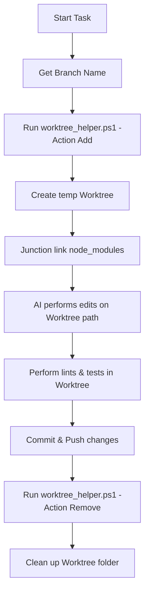

# Using Git Worktrees - Workspace Isolation Skill

## Overview
This skill provides the reasoning and tools to isolate agent workspace directories on Windows. It ensures that coding tasks run concurrently or purely in a temporary environment, avoiding side effects on the developer's main working repository.

---

## 🛠️ When to Use
* **Parallel Work:** When you want to run multiple tasks in parallel without interfering with your main working folder.
* **Safer Implementations:** When committing files on a clean branch is highly desired.
* **Test Isolation:** When running tests or builds that require a pristine directory state.

---

## 🏗️ How it Works
Instead of modifying files in the active workspace root (`c:\Users\jvb\Desktop\Family\`), a PowerShell helper manages copy/checkout processes:



---

## 🔧 Usage Guide

### 1. Initializing the Worktree
Call the helper script to create the worktree and link dependencies (node_modules) almost instantly:

```powershell
powershell -ExecutionPolicy Bypass -File .agent/skills/using-git-worktrees/scripts/worktree_helper.ps1 -Action Add -BranchName "feature/task-branch-name"
```

The script will output the path of the created worktree:
`PATH:C:\Users\jvb\AppData\Local\Temp\worktrees\feature\task-branch-name`

### 2. Performing the Work
Once created, **DO NOT** edit files in the main directory. Switch file access/editing scope to the new directory:
* Example: Edit `C:\Users\jvb\AppData\Local\Temp\worktrees\feature\task-branch-name\frontend\src\components\Button.tsx` instead of `c:\Users\jvb\Desktop\Family\frontend\src\components\Button.tsx`.

### 3. Verification & CI Checks
Perform verification inside the worktree path:
```powershell
# cd into the temporary worktree and run tests
cd C:\Users\jvb\AppData\Local\Temp\worktrees\feature\task-branch-name
npm run build
npm run test
```

### 4. Committing and Pushing
When checks pass, stage changes, commit, and push from the worktree:
```powershell
cd C:\Users\jvb\AppData\Local\Temp\worktrees\feature\task-branch-name
git add .
git commit -m "feat: implement task feature"
git push origin feature/task-branch-name
```

### 5. Cleaning Up
After pushing, clean up and delete the worktree in the principal codebase folder:
```powershell
powershell -ExecutionPolicy Bypass -File .agent/skills/using-git-worktrees/scripts/worktree_helper.ps1 -Action Remove -BranchName "feature/task-branch-name"
```

### 6. Scheduled Cleanup
Before beginning any large orchestration, run the cleanup action to remove orphaned folders of blocked/cancelled agent sessions:
```powershell
powershell -ExecutionPolicy Bypass -File .agent/skills/using-git-worktrees/scripts/worktree_helper.ps1 -Action Cleanup
```
